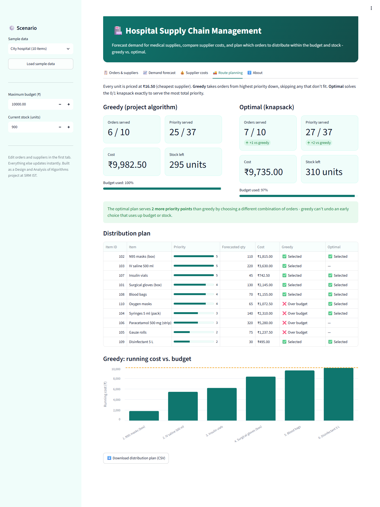
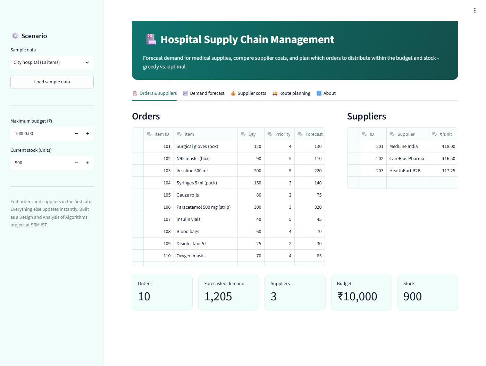
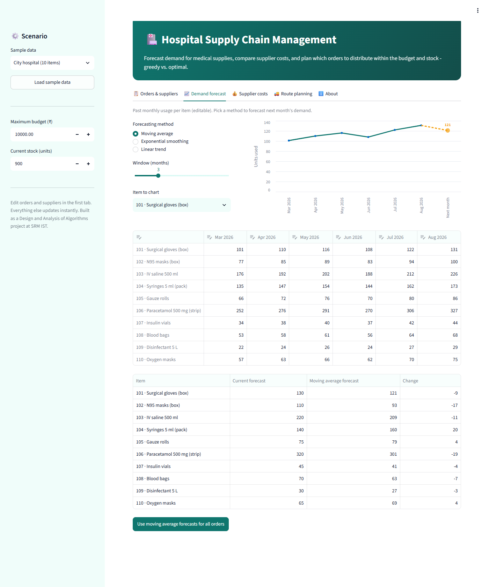
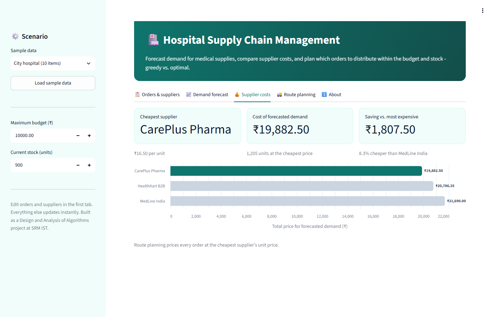

# Supply Chain Management System for a Hospital

A supply chain management system for a hospital, available as an interactive web app and a command-line program. It forecasts demand for medical supplies, works out supplier costs, and plans distribution routes that stay within a budget and the current stock level.

This was built as a Design and Analysis of Algorithms (DAA) project at SRM Institute of Science and Technology, Kattankulathur (November 2023), under the guidance of Dr. Rajkumar K, Department of Data Science and Business Systems.

**Team**

- Aditii Sharma (RA2211027010093)
- Parth Bhunia (RA2211027010096)
- Arnav Gupta (RA2211027010125)

## Interactive web app

The project also comes as an interactive **Streamlit** dashboard.



- **Orders & suppliers:** edit orders (item, quantity, priority 1–5, forecast) and suppliers in spreadsheet-style tables, or load a sample scenario.
- **Demand forecast:** predict next month's demand from six months of usage using a moving average, exponential smoothing or a linear trend, then apply the forecasts to every order in one click.
- **Supplier costs:** compare what the forecasted demand costs at each supplier, and see the saving from choosing the cheapest.
- **Route planning:**
  - Runs the project's greedy algorithm alongside an exact **0/1 knapsack** optimum.
  - Shows orders and priority served, cost, remaining stock and budget used.
  - Explains why each order was skipped, charts the running cost against the budget, and lets you download the plan as CSV.

| Orders & suppliers | Demand forecast | Supplier costs |
|---|---|---|
|  |  |  |

### Run it locally

```bash
pip install -r requirements.txt
streamlit run streamlit_app.py
```

### Deploy it for free

1. Sign in to [Streamlit Community Cloud](https://share.streamlit.io) with GitHub.
2. Click **Create app** and pick this repository.
3. Keep the default main file `streamlit_app.py` and deploy.

## Features (command-line version)

- **Order input:** item ID, quantity and priority (1–5) for each order.
- **Supplier input:** supplier ID, name and price per unit (INR).
- **Demand forecasting:** reads a forecasted quantity for each item.
- **Cost optimisation:** computes each supplier's total price for the forecasted demand.
- **Route planning (greedy):** chooses which orders to distribute, highest priority first, within the maximum budget and current stock.

## Running the command-line version

Requires Python 3 and no third-party packages.

```bash
python main.py
```

The program prompts for every value. To replay the example from the project report:

```bash
python main.py < sample_input.txt
```

### Example

Input (from `sample_input.txt`):

| Item ID | Quantity | Priority | Forecasted quantity |
|---|---|---|---|
| 101 | 50 | 4 | 60 |
| 102 | 30 | 5 | 35 |
| 103 | 20 | 3 | 25 |

Suppliers: 201 Supplier A at ₹10.50/unit and 202 Supplier B at ₹12.00/unit. Maximum budget ₹1500, current stock 100.

Output:

```
Selected Distribution Routes:
Item ID: 102, Forecasted Quantity: 35, Priority: 5
Item ID: 101, Forecasted Quantity: 60, Priority: 4
```

Order 102 (priority 5) is picked first: 35 units cost ₹367.50 at the cheapest unit price (₹10.50) and leave 65 in stock. Order 101 comes next: 60 units bring the cost to ₹997.50 and leave 5 in stock. Order 103 needs 25 units, which is more than the 5 left, so it is skipped.

## Algorithm: greedy route planning

`route_planning` in [main.py](main.py):

1. Sort orders by priority, highest first.
2. Start with an empty list of distribution routes and zero cost.
3. For each order, price its forecasted quantity at the cheapest supplier's unit price.
4. Add the order if the running cost stays within the maximum budget and the remaining stock covers its forecasted quantity, then subtract that quantity from the stock.
5. Return the selected routes.

### Time complexity

| Case | Complexity | Reason |
|---|---|---|
| Best | O(n log n) | Sorting the orders by priority |
| Average | O(n log n) | Sorting the orders by priority |
| Worst | O(n log n) | Sorting the orders by priority |

Here n is the number of orders. The loop also finds the cheapest supplier for each order, which adds O(n·m) for m suppliers; with few suppliers the sort dominates.

### Compared with other approaches

| Approach | Time complexity | Notes |
|---|---|---|
| Greedy (used here) | O(n log n) | Fast and simple; gives a good but not always optimal selection |
| Dynamic programming | O(n²) to O(2ⁿ) | Can find the optimal selection, but needs well-defined overlapping subproblems |
| Branch and bound | O(bᵈ) worst case, polynomial with good pruning | Optimal; cost depends on how well branches are pruned |

Greedy suits quick, approximate answers on small and medium inputs. Dynamic programming or branch and bound are the choice when the selection must be optimal and the extra computation is acceptable.

### The optimal version in the web app

Every order is priced at the same cheapest unit price, so the budget and stock limits combine into a single capacity in units. That makes route planning a **0/1 knapsack** problem (weight = forecasted quantity, value = priority). Priorities are small (at most 5 per order), so the app runs a DP over total priority, "fewest units needed to reach priority *v*". That takes O(n·P) time, where P ≤ 5n, however large the stock is. The **Route planning** tab shows both plans side by side and highlights when greedy falls short.

## Tests

```bash
pip install -r requirements.txt -r requirements-dev.txt
pytest
```

There are 52 tests:
- The greedy and optimal planners, including 40 randomised checks of the optimum against brute force.
- The forecasting methods.
- The CLI reproducing the report's output.
- Streamlit `AppTest` runs of the dashboard.

GitHub Actions runs them on every push.

## Repository layout

```
.
├── streamlit_app.py        # interactive web app
├── scm.py                  # core logic: costs, greedy + optimal planning, forecasting
├── main.py                 # original command-line program
├── sample_input.txt        # example input from the report
├── tests/                  # pytest suite
├── docs/screenshots/       # screenshots used in this README
├── .streamlit/config.toml  # app theme
└── requirements.txt
```
